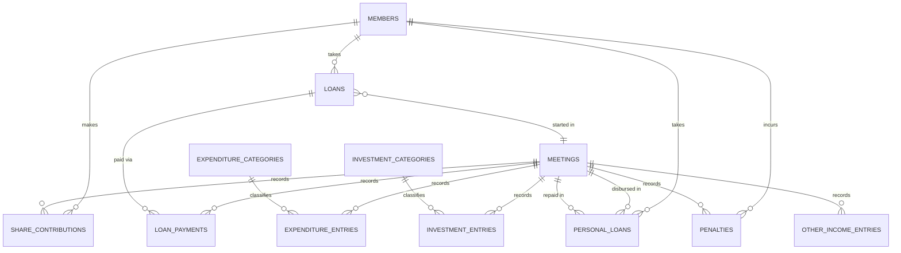

# Masiriyamman Mandram — Loan & Savings Ledger App

This documents the **as-built** application (not the original plan — see "Changes from the
original plan" at the bottom for what shifted during implementation).

Stack: **Flask (Python) + React + MySQL**, running as two independent apps:
- Backend: `mandram-backend/` — Flask API on port `5001`, its own Python venv (`mandram-backend/venv`)
- Database: `mandram_db` (MySQL) — separate from the repo's other `todo_app_db` database
- Frontend: React app in `frontend/`, on port `3000` — Mandram is the *only* thing this app does
  (no other pages, no shared login system with any other app)

## 1. Background

The group (மசிரியம்மன் மன்றம்) is a member-run thrift & credit association. Every month, at
a meeting, the treasurer records:

- **Member Ledger** (Sheet 1 equivalent): one row per member covering their share
  contribution, EMI loan activity, personal loan activity, and any penalty.
- **Monthly Summary** (Sheet 2 equivalent): aggregates the month into total income/expenditure,
  savings/investments made with surplus funds, and rolls forward the cash balance.

## 2. Glossary

| Tamil term | English | Meaning |
|---|---|---|
| பங்கு தொகை | Share amount | Fixed monthly contribution every member pays |
| நிலுவை கடன் | (EMI) Loan | Long-term loan repaid in installments over several months |
| மாதத்தவணை தொகை | Installment / EMI | Amount paid this month toward an EMI loan's principal |
| வட்டி | Interest | Interest amount, entered manually each month |
| தனிக்கடன் | Personal loan | Short-term loan: disbursed one month, repaid in full (principal + interest) the next month |
| விதிமீறல் அபராதம் | Penalty / fine | Manual fine on a member, with a reason |
| சீட்டு மற்றும் சேமிப்பு | Chit & savings | Surplus group funds placed into outside chits, gold, etc. |
| இந்த மாத மொத்த இருப்பு | Closing balance | Cash on hand at the end of this month's meeting |
| மன்றத்தின் மொத்த மதிப்பு | Mandram total value | The trust's headline net-worth figure (see §5 — currently defined as equal to closing balance) |

## 3. Business rules

- **Personal loans are single-cycle**: disbursed in meeting *N*, expected to be fully repaid
  (principal + interest, one lump sum) in meeting *N+1*. If it isn't repaid by the very next
  meeting, it shows as **pending** in every subsequent meeting's ledger until it is repaid.
- **EMI loans are multi-month**: opened once, then an installment + interest is recorded every
  meeting until the loan is fully paid off (however many months that takes — not a fixed count).
- **The month a loan is opened, no payment is due yet.** Both loan types show a "given this
  month, due starting next meeting" state in the Member Ledger for their disbursement month —
  no installment/repayment fields appear until the *following* meeting.
- **Interest is always entered manually** by the treasurer — never computed from a rate.
- **Expenditure and Investment/Savings entries use fixed dropdown categories**, seeded once
  (Electricity, Hall Rent, Stationery, Miscellaneous / Gold, Outside Chit, Fixed Deposit) and
  extendable by an admin via the categories endpoints.
- **Penalties are a manual entry** (amount + free-text reason) against a member for a given
  meeting, editable/removable individually.
- A member has **at most one active EMI loan at a time**, and **at most one outstanding personal
  loan at a time**.
- **Once a meeting is finalized, everything tied to it is locked.** Every write endpoint that
  touches a meeting's data checks `ensure_meeting_editable()` and returns `409` if that meeting
  (or, for personal loans, either its disbursed or repaid meeting) is already finalized. This
  keeps a closed month's frozen `closing_balance`/`trust_total_value` from silently going stale.
- Every ledger/history view has **Month/Year and Member dropdown filters**.

## 4. Data model (MySQL — `mandram_db`)



Tables (see `mandram-backend/models.py` for the SQLAlchemy definitions):
`members`, `meetings`, `share_contributions`, `loans`, `loan_payments`, `personal_loans`,
`penalties`, `expenditure_categories`, `expenditure_entries`, `investment_categories`,
`investment_entries`, `other_income_entries`.

Key fields worth knowing:
- `loans.start_meeting_id` — the meeting the loan was opened in. This drives the "given this
  month, no payment due yet" display (§3).
- `meetings.opening_balance` / `closing_balance` / `trust_total_value` — only **frozen and
  authoritative once `status = 'finalized'`**. Before that, they're recomputed live on every
  read (see §5).

## 5. Derived calculations (`mandram-backend/services/summary_service.py`)

**Opening balance** (`resolve_opening_balance`): the previous meeting's closing balance if that
meeting is finalized (frozen value), otherwise its *live* recomputed closing balance (since a
draft month can still change), or `0` if there is no previous meeting. This resolves recursively
back through a chain of draft meetings.

**Monthly summary** (`compute_summary`), for a given `meeting_id`:

```
total_share_income           = SUM(share_contributions.amount)
total_emi_interest            = SUM(loan_payments.interest_paid)
total_personal_loan_interest  = SUM(personal_loans.interest_amount WHERE repaid_meeting_id = this)
total_income                  = total_share_income + total_emi_interest
                               + total_personal_loan_interest + SUM(other_income_entries.amount)

total_expenditure             = SUM(expenditure_entries.amount)
net_income                    = total_income - total_expenditure

emi_principal_collected       = SUM(loan_payments.installment_paid)
personal_loan_collected       = SUM(personal_loans.amount WHERE repaid_meeting_id = this)
new_personal_loans_disbursed  = SUM(personal_loans.amount WHERE disbursed_meeting_id = this)
new_emi_loans_disbursed       = SUM(loans.principal_amount WHERE start_meeting_id = this)
total_investment_outflow      = SUM(investment_entries.amount)

closing_balance = opening_balance + net_income
                + emi_principal_collected + personal_loan_collected
                - new_personal_loans_disbursed - new_emi_loans_disbursed
                - total_investment_outflow

trust_total_value = closing_balance
```

Two things that changed from a naive first pass, worth remembering:
- **New EMI loans reduce the closing balance**, exactly like new personal loans do — opening a
  loan is real cash leaving the treasury, not a neutral event.
- **`trust_total_value` is deliberately just `closing_balance`** — it does *not* add back
  outstanding EMI/personal loan balances. (`outstanding_emi_loans` and
  `outstanding_personal_loans` are still returned by the summary endpoint as informational
  figures, just not folded into the headline total.)

Finalizing a meeting (`finalize_meeting`) freezes `opening_balance`, `closing_balance`, and
`trust_total_value` onto the `meetings` row and flips `status` to `finalized`.

## 6. Member Ledger states (`mandram-backend/services/ledger_service.py`)

For a given member + meeting, `build_ledger_row` returns:

| Field | Meaning |
|---|---|
| `share_amount` | This meeting's share contribution, if entered |
| `emi_loan` | `null` if no active loan. Otherwise `{ just_given, principal_amount, installment_paid, interest_paid, outstanding_balance }` — `just_given = true` when this meeting *is* the loan's `start_meeting_id` (no installment fields shown yet) |
| `personal_loan_repaid` | A personal loan repaid **in this meeting** — `{ amount, interest_amount }` |
| `personal_loan_new` | A personal loan disbursed **in this meeting** and not yet repaid — `{ amount }` |
| `personal_loan_pending` | A personal loan disbursed in an **earlier** meeting still awaiting repayment — `{ amount }` |
| `penalties` | List of `{ id, amount, reason }` for this member/meeting (each individually editable) |

The Member Ledger UI (`MandramLedger.js`) renders each of these as its own inline-editable
cell — share amount, EMI installment/interest, the three personal-loan states, and per-penalty
rows — with icon buttons for edit/save/remove, matching the color scheme in §8.

**Chronology guard**: `build_ledger_row` compares `(year, month)` between the meeting being
viewed and the loan's own reference meeting(s) before showing anything:
- An EMI loan (`active_loan`) is only considered for a row if the viewed meeting is on or after
  its `start_meeting_id`'s month — a loan opened in July never appears in April/May/June's rows.
- A personal loan only counts as `personal_loan_pending` if its `disbursed_meeting_id`'s month is
  strictly *before* the viewed meeting's month.

Without this, a loan taken (or a personal loan still outstanding) would incorrectly show up as
payable/pending in every past meeting too, since the underlying query was just "this member's
currently active loan" with no month comparison. Share contributions, penalties, expenditure, and
investment entries were never affected — those are already filtered by an exact `meeting_id`
match, so they only ever belong to the one meeting they were entered in.

## 7. Monthly workflow (meeting lifecycle)

1. **Open a new meeting** — treasurer picks a date. Opening balance is resolved automatically
   (see §5), no manual entry needed.
2. **Enter the Member Ledger**, per member: share contribution; EMI installment + interest
   (once past the loan's opening month); personal loan repayment (if one is due) or a brand-new
   personal loan disbursement (via the `+` button, right from the ledger row); penalties.
3. **Open new EMI loans** (via the EMI Loans tab, or the ledger's "no active loan" cell has no
   inline opener — use the tab) and **disburse new personal loans** (via the Personal Loans tab
   *or* directly from the Member Ledger's `+` button).
4. **Enter expenditure and investments/savings** — category dropdown + amount + optional note.
5. **Review the Monthly Summary** — three tables (Income / Expenditure / Balance Roll-Forward),
   all computed live while the meeting is a draft. Balance Roll-Forward is the full reconciliation
   trail — last month's balance, this month's income, EMI/personal loan amounts collected, minus
   new loans given out, minus expenditure, minus investments — down to this month's total balance.
6. **Finalize the meeting** — locks every entry tied to it; freezes closing balance and trust
   value; that closing balance becomes next month's opening balance.
7. **Edit/undo before finalizing** — everything (members, meetings, loans, payments, personal
   loans, penalties, expenditure/investment entries) supports edit and delete up until the
   meeting they belong to is finalized. See §9 for the specific guard rules.

## 8. Frontend structure

```
frontend/src/
  App.js                      # Login gate -> Navbar -> MandramSection. No other pages.
  components/
    Navbar.js                 # Title bar + logout only (no sidebar — Mandram is the whole app)
  pages/
    LoginPage.js               # Local-only login gate (no backend auth exists for this app)
    mandram/
      MandramSection.js        # Tab bar + shared meeting-picker; owns selectedMeetingId state
      MandramMeetings.js        # List/create/edit/delete meetings
      MandramMembers.js         # Member CRUD
      MandramLedger.js          # Sheet-1 equivalent, full inline edit/remove, Month+Member filters
      MandramLoans.js            # EMI loan CRUD
      MandramPersonalLoans.js    # Disburse/repay/edit/remove/revert personal loans
      MandramExpenditures.js     # Category dropdown + entries, edit/remove
      MandramInvestments.js      # Category dropdown + entries, edit/remove
      MandramSummary.js          # Income / Expenditure / Balance Roll-Forward tables + Finalize Month
      IconButton.js               # Shared color-coded icon button (edit/save/remove/cancel/revert/add)
      Mandram.css
  services/
    mandramApi.js              # All API calls, base URL http://localhost:5001/api
  styles/
    Pages.css                  # Shared card/table/badge/tab-bar classes used throughout
```

Icon color convention (`IconButton.js` / `Mandram.css`): **edit** = indigo pencil, **save** =
green check, **remove** = red trash, **cancel** = gray X, **revert** = amber undo, **add** =
indigo plus.

## 9. REST API (`mandram-backend/`)

| Method | Path | Notes |
|---|---|---|
| GET/POST | `/api/members` | list / create |
| GET | `/api/members/{id}` | |
| PUT | `/api/members/{id}` | edit name/phone/joined_date/is_active |
| DELETE | `/api/members/{id}` | blocked (409) if the member has any contributions/loans/personal loans/penalties |
| GET/POST | `/api/meetings` | list / open a new meeting |
| GET | `/api/meetings/{id}` | |
| PUT | `/api/meetings/{id}` | edit date/notes; date edits blocked once finalized |
| DELETE | `/api/meetings/{id}` | blocked if finalized, or if it has *any* recorded ledger entries |
| GET | `/api/meetings/{id}/ledger` | Sheet-1 view — joined per-member rows (§6) |
| POST | `/api/meetings/{id}/share-contributions` | upsert one member's share amount |
| GET | `/api/meetings/{id}/summary` | live-computed Sheet-2 totals (§5) |
| POST | `/api/meetings/{id}/finalize` | lock month, freeze balances |
| GET/POST | `/api/loans` | list (filter by `member_id`/`status`) / open a new EMI loan |
| PUT | `/api/loans/{id}` | correct principal/outstanding/status directly |
| DELETE | `/api/loans/{id}` | blocked if any payment belongs to a finalized meeting |
| POST | `/api/loans/{id}/payments` | record this meeting's installment + interest |
| PUT | `/api/loans/{id}/payments/{meeting_id}` | edit a payment — only the loan's *most recent* payment can be edited |
| DELETE | `/api/loans/{id}/payments/{meeting_id}` | remove a payment, restoring the loan's outstanding balance — same "most recent only" rule |
| GET/POST | `/api/personal-loans` | list (filter by `member_id`/`status`) / disburse |
| PUT | `/api/personal-loans/{id}` | edit amount (while outstanding) / interest / or `revert_to_outstanding: true` |
| DELETE | `/api/personal-loans/{id}` | remove entirely |
| POST | `/api/personal-loans/{id}/repay` | mark repaid + interest, in a given meeting |
| GET/POST | `/api/penalties` | list (filter by `meeting_id`/`member_id`) / create |
| PUT/DELETE | `/api/penalties/{id}` | edit or remove |
| GET/POST | `/api/expenditure-categories` | manage the fixed dropdown |
| GET/POST | `/api/meetings/{id}/expenditures` | list / add an entry |
| PUT/DELETE | `/api/expenditure-entries/{id}` | edit or remove |
| GET/POST | `/api/investment-categories` | manage the fixed dropdown |
| GET/POST | `/api/meetings/{id}/investments` | list / add an entry |
| PUT/DELETE | `/api/investment-entries/{id}` | edit or remove |
| GET | `/api/members/{id}/history?month=&year=` | one member's ledger rows, filtered |
| GET | `/api/reports/trust-value-trend` | month-over-month trust value for charts (finalized meetings only) |

All mutating endpoints on meeting-scoped data call `ensure_meeting_editable()` (in
`services/guards.py`) and return **409** if the relevant meeting is already finalized.

## 10. Changes from the original plan

This app went through several rounds of real-world testing that changed the original design:

- **Framework**: originally speculated as Flask vs. the repo's existing FastAPI backend — settled
  on Flask, in its own `mandram-backend/` folder with its own venv, completely independent of the
  repo's other (now-deleted) FastAPI app and `todo_app_db`.
- **Frontend**: originally added alongside the repo's other app (shared sidebar, shared login).
  That was later stripped out entirely — the repo's old FastAPI backend, old React pages, and old
  docs were deleted, and `frontend/` now serves *only* the Mandram app behind a simple local login
  gate.
- **Trust value formula**: originally `closing_balance + outstanding loans` (treating receivables
  as an asset). Changed to just `closing_balance` per direct product feedback.
- **Opening balance**: originally frozen at meeting-creation time from the previous meeting's
  *stored* closing balance — which stayed `0` forever if that previous meeting was never
  finalized. Changed to resolve live/recursively from the previous meeting's current data.
- **EMI loans disbursing cash**: originally not subtracted from the closing balance at all
  (only personal loan disbursements were). Fixed to match.
- **"Given this month" states**: originally, both loan types showed payment-entry fields
  starting the very month they were opened. Fixed for personal loans first, then EMI loans, to
  correctly show "given, due next month" until the month has passed.
- **Personal loan ledger visibility**: originally only showed a loan the meeting it was *repaid*.
  Extended to also show it the meeting it was *disbursed*, and as *pending* in every meeting in
  between if it runs overdue.
- **Full edit/delete**: added after initial build across every entity, all gated by the
  finalized-meeting immutability rule.
- **Monthly Summary layout**: iterated from a tile grid → a combined principal+interest tile →
  four separate proper `<table>`s in a 2×2 grid → **collapsed to three tables** (Income /
  Expenditure / Balance Roll-Forward). The "Collections & Disbursements" table was removed
  entirely and folded into a fully-detailed Balance Roll-Forward: opening balance, + total
  income, + EMI/personal loan principal collected, − new EMI/personal loans disbursed, − total
  expenditure, − investment outflow, = current month total balance — plus the outstanding-loan
  and trust-value rows. Income and Expenditure sit side by side; Balance Roll-Forward spans full
  width below (current state, §9 layout — one `SummaryTable` per section, `fullWidth` prop for
  the wide one).
