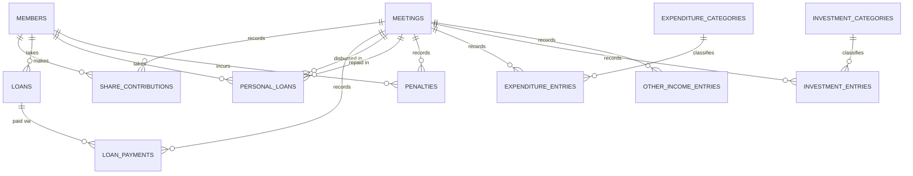

# Masiriyamman Mandram — Loan & Savings Ledger App

Working flow and data model for digitizing the group's monthly booklet ledger.
Stack: **Flask (Python) + React + MySQL**.

## 1. Background

The group (மசிரியம்மன் மன்றம்) is a member-run thrift & credit association. Every month, at
a meeting, the treasurer records two linked sheets by hand:

- **Sheet 1 — Per-Member Monthly Ledger**: one row per member covering their share
  contribution, EMI loan payment, personal loan repayment, and any penalty.
- **Sheet 2 — Monthly Summary**: aggregates Sheet 1 into total income/expenditure,
  records savings/investments made with surplus funds, lists any *new* personal loans
  disbursed that month, and rolls forward the cash balance and the trust's total value.

This document defines the schema and workflow to replace both sheets with a web app.

## 2. Glossary

| Tamil term | English | Meaning |
|---|---|---|
| பங்கு தொகை | Share amount | Fixed monthly contribution every member pays |
| நிலுவை கடன் | (EMI) Loan | Long-term loan repaid in installments over several months |
| மாதத்தவணை தொகை | Installment / EMI | Amount paid this month toward an EMI loan's principal |
| வட்டி | Interest | Interest amount, entered manually each month |
| மீதம் உள்ள கடன் தொகை | Outstanding balance | Remaining EMI loan principal after this month's payment |
| தனிக்கடன் | Personal loan | Short-term loan: disbursed one month, repaid in full (principal + interest) the next month |
| விதிமீறல் அபராதம் | Penalty / fine | Manual fine on a member, with a reason |
| சீட்டு மற்றும் சேமிப்பு | Chit & savings | Surplus group funds placed into outside chits, gold, etc. |
| இந்த மாத மொத்த இருப்பு | Closing balance | Cash on hand at the end of this month's meeting |
| மன்றத்தின் மொத்த மதிப்பு | Trust total value | Cumulative net worth = cash + all outstanding loans receivable |

## 3. Business rules (confirmed)

- **Personal loans are single-cycle**: disbursed in meeting *N*, always fully repaid
  (principal + interest, one lump sum) in meeting *N+1*. No partial/rolling personal loans.
- **Interest is always entered manually** by the treasurer — the app does not compute it
  from a rate. This applies to both EMI-loan interest and personal-loan interest.
- **Expenditure and Investment/Savings entries use fixed dropdown categories**, managed
  by an admin (e.g. Electricity, Misc for expenditure; Gold, Outside Chit for
  investment). New categories can be added by an admin but data entry itself is
  dropdown-only.
- **Penalties are always a manual entry** (amount + free-text reason) against a member
  for a given meeting — no automatic late-payment detection.
- A member has **at most one active EMI loan at a time** (matches the single EMI
  column pair in the booklet).
- Every screen that lists ledger data (member ledger, history, reports) needs **Month/Year**
  and **Member** dropdown filters, as in the booklet's per-member-per-month structure.

## 4. Data model (MySQL)



```sql
CREATE TABLE members (
  id            INT AUTO_INCREMENT PRIMARY KEY,
  name          VARCHAR(150) NOT NULL,
  phone         VARCHAR(20),
  joined_date   DATE,
  is_active     BOOLEAN DEFAULT TRUE,
  created_at    TIMESTAMP DEFAULT CURRENT_TIMESTAMP
);

CREATE TABLE meetings (
  id                  INT AUTO_INCREMENT PRIMARY KEY,
  meeting_date        DATE NOT NULL,
  month               TINYINT NOT NULL,
  year                SMALLINT NOT NULL,
  opening_balance     DECIMAL(12,2) NOT NULL DEFAULT 0,
  closing_balance     DECIMAL(12,2),
  trust_total_value   DECIMAL(12,2),
  status              ENUM('draft','finalized') DEFAULT 'draft',
  notes               TEXT,
  created_at          TIMESTAMP DEFAULT CURRENT_TIMESTAMP,
  UNIQUE KEY uq_month_year (month, year)
);

CREATE TABLE share_contributions (
  id          INT AUTO_INCREMENT PRIMARY KEY,
  member_id   INT NOT NULL REFERENCES members(id),
  meeting_id  INT NOT NULL REFERENCES meetings(id),
  amount      DECIMAL(12,2) NOT NULL,
  UNIQUE KEY uq_member_meeting (member_id, meeting_id)
);

CREATE TABLE loans (
  id                          INT AUTO_INCREMENT PRIMARY KEY,
  member_id                   INT NOT NULL REFERENCES members(id),
  principal_amount            DECIMAL(12,2) NOT NULL,
  start_meeting_id            INT REFERENCES meetings(id),
  status                      ENUM('active','closed') DEFAULT 'active',
  current_outstanding_balance DECIMAL(12,2) NOT NULL,
  created_at                  TIMESTAMP DEFAULT CURRENT_TIMESTAMP
);

CREATE TABLE loan_payments (
  id                        INT AUTO_INCREMENT PRIMARY KEY,
  loan_id                   INT NOT NULL REFERENCES loans(id),
  meeting_id                INT NOT NULL REFERENCES meetings(id),
  installment_paid          DECIMAL(12,2) NOT NULL DEFAULT 0,
  interest_paid             DECIMAL(12,2) NOT NULL DEFAULT 0,
  outstanding_balance_after DECIMAL(12,2) NOT NULL,
  UNIQUE KEY uq_loan_meeting (loan_id, meeting_id)
);

CREATE TABLE personal_loans (
  id                        INT AUTO_INCREMENT PRIMARY KEY,
  member_id                 INT NOT NULL REFERENCES members(id),
  amount                    DECIMAL(12,2) NOT NULL,
  disbursed_meeting_id      INT NOT NULL REFERENCES meetings(id),
  expected_repay_meeting_id INT REFERENCES meetings(id),
  status                    ENUM('outstanding','repaid') DEFAULT 'outstanding',
  interest_amount           DECIMAL(12,2),
  repaid_meeting_id         INT REFERENCES meetings(id),
  created_at                TIMESTAMP DEFAULT CURRENT_TIMESTAMP
);

CREATE TABLE penalties (
  id          INT AUTO_INCREMENT PRIMARY KEY,
  member_id   INT NOT NULL REFERENCES members(id),
  meeting_id  INT NOT NULL REFERENCES meetings(id),
  amount      DECIMAL(12,2) NOT NULL,
  reason      VARCHAR(255) NOT NULL,
  created_at  TIMESTAMP DEFAULT CURRENT_TIMESTAMP
);

CREATE TABLE expenditure_categories (
  id    INT AUTO_INCREMENT PRIMARY KEY,
  name  VARCHAR(100) NOT NULL UNIQUE
);

CREATE TABLE expenditure_entries (
  id           INT AUTO_INCREMENT PRIMARY KEY,
  meeting_id   INT NOT NULL REFERENCES meetings(id),
  category_id  INT NOT NULL REFERENCES expenditure_categories(id),
  amount       DECIMAL(12,2) NOT NULL,
  note         VARCHAR(255)
);

CREATE TABLE investment_categories (
  id    INT AUTO_INCREMENT PRIMARY KEY,
  name  VARCHAR(100) NOT NULL UNIQUE
);

CREATE TABLE investment_entries (
  id           INT AUTO_INCREMENT PRIMARY KEY,
  meeting_id   INT NOT NULL REFERENCES meetings(id),
  category_id  INT NOT NULL REFERENCES investment_categories(id),
  amount       DECIMAL(12,2) NOT NULL,
  note         VARCHAR(255)
);

CREATE TABLE other_income_entries (
  id           INT AUTO_INCREMENT PRIMARY KEY,
  meeting_id   INT NOT NULL REFERENCES meetings(id),
  description  VARCHAR(255),
  amount       DECIMAL(12,2) NOT NULL
);
```

**Why personal loans are one table, not two sections:** the booklet's Sheet 1 "தனிக்கடன்"
column and Sheet 2's "இந்த மாத தனிக்கடன்" table are the *same* loan viewed at two points in
its lifecycle — Sheet 2 shows it the month it's **disbursed** (`disbursed_meeting_id`),
Sheet 1 shows it the month it's **repaid** (`repaid_meeting_id`). One `personal_loans` row
covers the full cycle.

## 5. Derived calculations (Sheet 2, computed — not stored until a meeting is finalized)

For a given `meeting_id`:

```
total_share_income          = SUM(share_contributions.amount)
total_emi_interest           = SUM(loan_payments.interest_paid)
total_personal_loan_interest = SUM(personal_loans.interest_amount WHERE repaid_meeting_id = this)
total_income                 = total_share_income + total_emi_interest
                              + total_personal_loan_interest + SUM(other_income_entries.amount)

total_expenditure            = SUM(expenditure_entries.amount)
net_income                   = total_income - total_expenditure

emi_principal_collected      = SUM(loan_payments.installment_paid)
personal_loan_collected      = SUM(personal_loans.amount WHERE repaid_meeting_id = this)
new_personal_loans_disbursed = SUM(personal_loans.amount WHERE disbursed_meeting_id = this)
total_investment_outflow     = SUM(investment_entries.amount)

closing_balance = opening_balance + net_income
                + emi_principal_collected + personal_loan_collected
                - new_personal_loans_disbursed - total_investment_outflow

trust_total_value = closing_balance
                   + SUM(loans.current_outstanding_balance WHERE status='active')
                   + SUM(personal_loans.amount WHERE status='outstanding')
```

`opening_balance` for a meeting = previous meeting's `closing_balance` (0 for the first
meeting ever recorded).

## 6. Monthly workflow (meeting lifecycle)

1. **Open a new meeting** — treasurer picks the date; app auto-fills `opening_balance`
   from the previous meeting's `closing_balance` and lists all active members.
2. **Enter Sheet 1 rows**, per member (all editable inline, filterable by member):
   - Share contribution amount (defaults to standard, e.g. ₹1000; editable).
   - If the member has an active EMI loan: installment paid + interest paid →
     new `loan_payments` row; `loans.current_outstanding_balance` updates.
   - If the member has an outstanding personal loan due this month: mark repaid,
     enter interest → updates that `personal_loans` row (`status='repaid'`,
     `repaid_meeting_id`, `interest_amount`).
   - Optional penalty: amount + reason.
3. **Enter new personal loan disbursements** (Sheet 2 §4) — pick member(s) + amount;
   creates `personal_loans` rows with `status='outstanding'`,
   `disbursed_meeting_id` = this meeting.
4. **Enter expenditure** — category dropdown + amount + optional note.
5. **Enter investments/savings** — category dropdown + amount + optional note.
6. **Enter other income**, if any (free text + amount).
7. **Preview Monthly Summary** (Sheet 2) — all figures from §5 computed live so the
   treasurer can review before locking.
8. **Finalize the meeting** — locks all entries for that month (read-only afterward),
   stores `closing_balance` and `trust_total_value` on the `meetings` row, which
   becomes next month's `opening_balance`.
9. **Announce lending capacity** — the finalized `closing_balance` is what's available
   to lend out as new personal/EMI loans next month.

## 7. Application architecture

```
backend/            Flask app
  app.py             app factory, blueprint registration
  models.py          SQLAlchemy models (tables above)
  routes/
    members.py
    meetings.py
    loans.py
    personal_loans.py
    penalties.py
    expenditures.py
    investments.py
    summary.py
  services/
    summary_service.py   # §5 calculations
  config.py
  extensions.py          # db, migrate

frontend/src/
  pages/
    Dashboard.js          # trust value trend, quick stats
    Meetings.js            # list/create meetings
    MemberLedger.js        # Sheet 1 equivalent, Month+Member filter dropdowns
    PersonalLoans.js        # disburse new / view outstanding
    Expenditures.js
    Investments.js
    MonthlySummary.js       # Sheet 2 equivalent + Finalize button
    MemberHistory.js        # single member across months (Member+Month filters)
    Members.js               # member CRUD
  components/
    MonthYearPicker.js
    MemberDropdown.js
  services/api.js
```

### Key REST endpoints

| Method | Path | Purpose |
|---|---|---|
| GET/POST | `/api/members` | list / create members |
| GET/POST | `/api/meetings` | list / open a new meeting |
| GET | `/api/meetings/{id}/ledger` | Sheet 1: joined per-member rows for that meeting |
| POST | `/api/meetings/{id}/share-contributions` | record share amount |
| POST | `/api/loans` | open a new EMI loan for a member |
| POST | `/api/loans/{id}/payments` | record this meeting's installment + interest |
| POST | `/api/personal-loans` | disburse a new personal loan |
| POST | `/api/personal-loans/{id}/repay` | mark repaid + interest, for a meeting |
| POST | `/api/penalties` | add a penalty |
| GET/POST | `/api/expenditure-categories` | manage dropdown list |
| POST | `/api/meetings/{id}/expenditures` | add expenditure entry |
| GET/POST | `/api/investment-categories` | manage dropdown list |
| POST | `/api/meetings/{id}/investments` | add investment entry |
| GET | `/api/meetings/{id}/summary` | Sheet 2: computed totals (§5) |
| POST | `/api/meetings/{id}/finalize` | lock month, persist closing balance & trust value |
| GET | `/api/members/{id}/history?month=&year=` | one member's ledger rows, filtered |
| GET | `/api/reports/trust-value-trend` | month-over-month trust value for charts |

## 8. Open items to confirm later

- Row 10's member name in the sample sheet was illegible in the photo — confirm the
  actual name before seeding `members`.
- The handwritten "இந்த மாத மொத்த இருப்பு = 63" figure on Sheet 2 didn't reconcile
  cleanly with the other totals in the sample photo — treated as the treasurer's own
  scratch check, not modeled as a stored field. Worth double-checking against a clean
  month's data once real entry starts.
